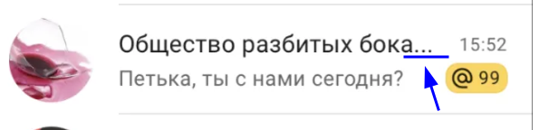

https://blackrule.github.io/2024-2-VK-EDU-Frontend-I-Chernovalov/  
simultaneous use in multiple tabs is not supported

## Why I'm using Material symbols the way I'm using them and not https://www.npmjs.com/package/react-material-symbols ?
it's because I know how to customize them the way I use them and I don't know in case of npm package. The package might leak global CSS for the icons same way as current method I - didn't test it -  but what's the point of the package then?...

## Почему нету ellipsis у имени чата в списке чатов?

Если мне можно делать дизайн по своему, то хочу чтобы у пользователя была возможность прочитать всё и ничего не обрезалось бы

# React + Vite

This template provides a minimal setup to get React working in Vite with HMR and some ESLint rules.

Currently, two official plugins are available:

- [@vitejs/plugin-react](https://github.com/vitejs/vite-plugin-react/blob/main/packages/plugin-react/README.md) uses [Babel](https://babeljs.io/) for Fast Refresh
- [@vitejs/plugin-react-swc](https://github.com/vitejs/vite-plugin-react-swc) uses [SWC](https://swc.rs/) for Fast Refresh
